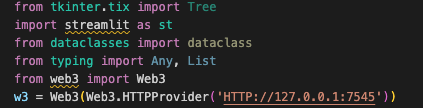
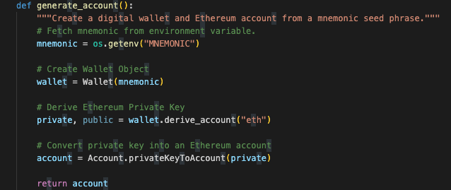
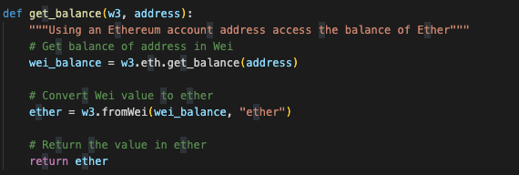
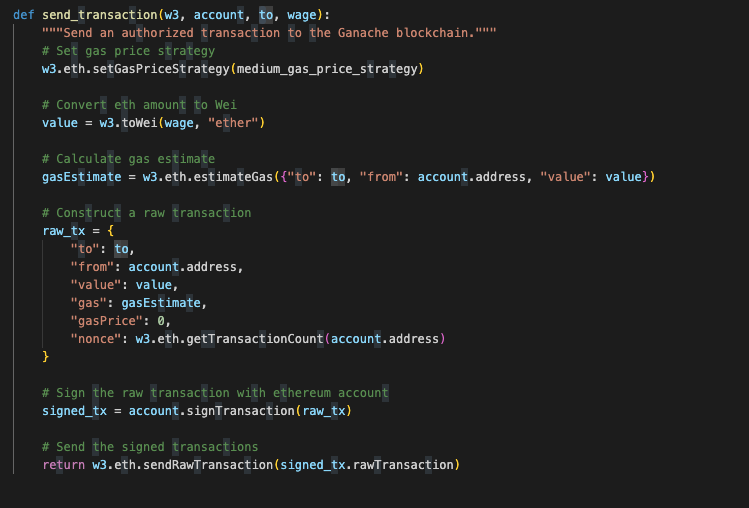
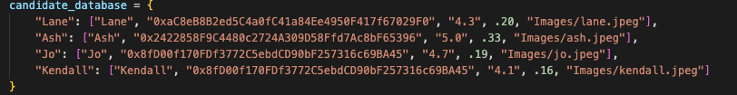
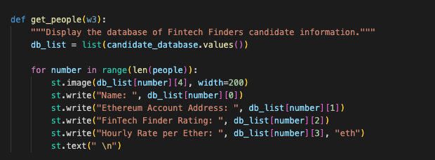
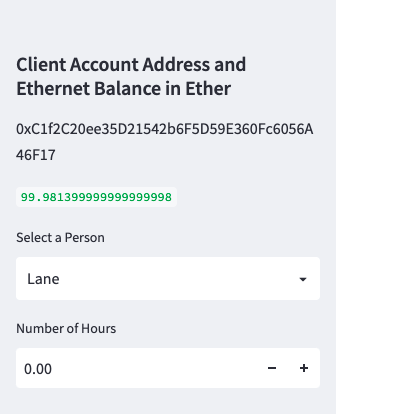
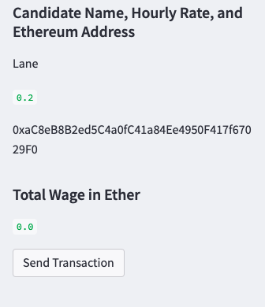
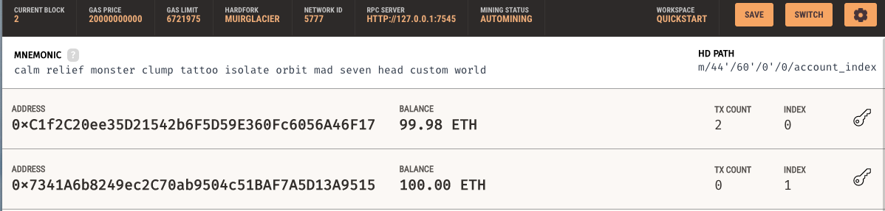
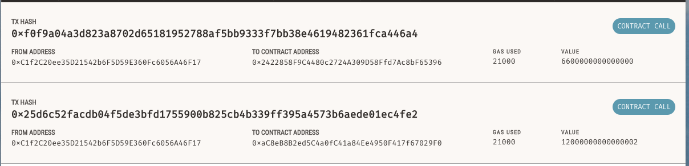

# Crypto-Paycheck-Ledger

The application uses blockchain's cryptocurrency to hire and pay fintech professional candidates. The program includes a list of cadidates and some of their credintials and their expected pay. 

Here, the program is using ethereum based technology to pay the candidates for their work. The blockchain is powered useing Ganache, which allows to run a local blockchain.

---
## Technology

The application utilizes Visual Studio Code as the writing platform, was written using python code, uses Ganache to facilitate a local blockchain environment, while streamlit enables the program's frontend execution.

### Installation

The following installations need to be made prior to running the program:
 * install bip44(for generate private and public keyt)          command >>pip install bip44
 * install streamlit(for interactive frontend execution)        command >>pip install streamlit
 * install dotenv(to get hidden mnemonics)                      command >>pip install dotenv
 * install web3(allows python interaction with ethereum)        command >>pip install web3
 
Import the following libraries and functions

---

### The program

The application consists of two set of python files.

"crypto_wallet.py" contains set of codes that create functions that enable the program to generate the blockchain account, , extract balances, and send cryto currencies.

* To create blockchain account

* Extract blockchain balances

* Send Cryptocurrency (ETH)

"fintech_finder.py" contains set of codes, including the list of candidates, streamlit codes, as well as how the transaction would take place, digital signatures for transaction. 

---

### Frontend display on streamlit

---
### ledger

### Blockchain ledger on Ganache

---

Babin Shrestha